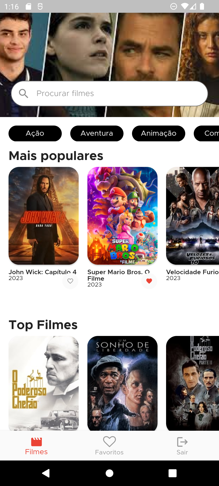

# app_filmes

Aplicativo de filmes desenvolvido em flutter com o objetivo de treinar o consumo de API's.

## Descrição

O aplicativo possui uma tela de login no qual poderá ser feito o login com o Google. Após o login, o usuário será redirecionado para a tela principal do aplicativo, onde poderá ver os filmes mais populares, os filmes mais bem avaliados. Ao clicar em um filme, o usuário será redirecionado para a tela de detalhes do filme, onde poderá ver mais informações sobre o filme. O usuário poderá adicionar o filme aos favoritos, e poderá ver os filmes favoritos na tela de favoritos.

## Design

O design do aplicativo foi feito utilizando o Figma, e pode ser acessado através do link: https://www.figma.com/file/04HOIeCejfpFp5tw1yD0Xd/App-Filmes?type=design&node-id=0%3A1&t=KzZ5RnZrWGOwUMrD-1

## API

A API utilizada foi a do The Movie DB, e pode ser acessada através do link: https://developers.themoviedb.org/3/getting-started/introduction

## Dependências

As dependências utilizadas no projeto foram:

- get: ^4.6.5 (Para gerenciamento de estado, navegação e injeção de dependência)
- firebase_core: ^2.11.0 (Para configuração do firebase)
- firebase_auth: ^4.5.0 (Para autenticação com o firebase)
- firebase_remote_config: ^4.1.0 (Para salvar a chave da API do The Movie DB no firebase)
- cloud_firestore: ^4.7.0 (Para salvar os filmes favoritos no firebase)
- sign_in_button: ^3.2.0 (Para utilizar o botão de login do Google)
- google_sign_in: ^6.1.0 (Para autenticação com o Google)
- intl: ^0.18.1 (Para formatação de datas)
- diacritic: ^0.1.3 (Para remover acentos)
- flutter_rating_stars: ^1.0.3+4 (Para exibir as estrelas de avaliação)

